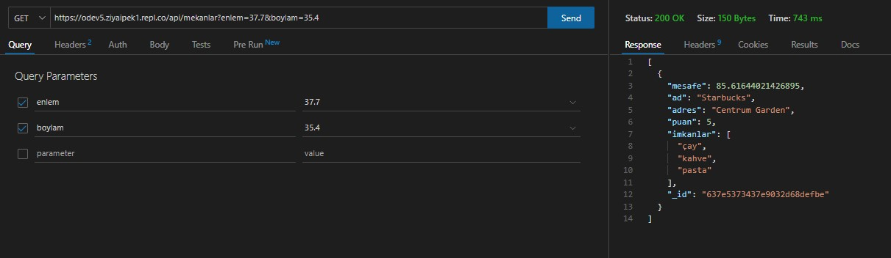
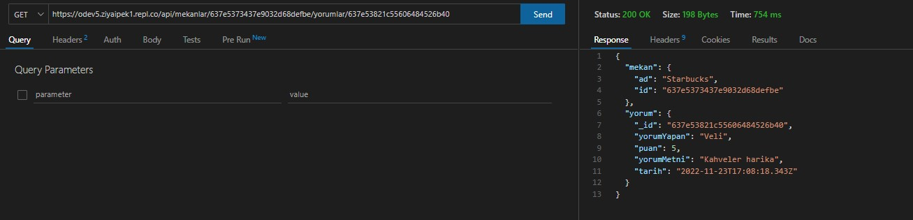

# MekanBul REST API Testleri
1. Thunder API

2. test.js

 

# MekanBul REST API Adresleri

1. [Girilen Konum Civarındaki Mekanları Listele](https://odev5.ziyaipek1.repl.co/api/mekanlar?enlem=37.7&boylam=35.4)

2. [Mekanın IDsi İle Mekan Bilgilerini Getir](https://odev5.ziyaipek1.repl.co/api/mekanlar/637e5373437e9032d68defbe)

3. [Bir Mekana Ait Belirli Bir Yorumu Getir](https://odev5.ziyaipek1.repl.co/api/mekanlar/637e5373437e9032d68defbe/yorumlar/637e53821c55606484526b40)

